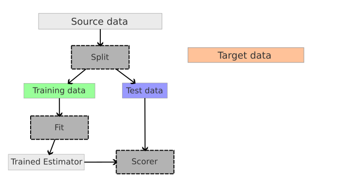

# Users Guide

The core concept introduced with this API are the following:
* `sample_domain` labels
* `DomainAwareDataset` API
* `Adapter` interface
* Pipeline, `make_da_pipeline` and selectors
* Model selection (model scoring, splitters)

The are a few test suites available to see examples, specifically
* `tests/test_mapping.py`
* `tests/test_reweight.py`
* `tests/test_subspace.py`
* `tests/test_pipeline.py`
* `tests/test_scorer.py`
* `tests/test_cv.py`
* `datasets/tests/test_samples_generator.py`
* `datasets/tests/test_office.py`

To run all tests, simply execute

```shell
pytest skada/ --ignore=skada/deep
```

A test suite for new datasets API is on its way. A separate test suite for new `Office31` dataset is already in there (note, it take a bit longer to run compared to other tests as it has to fetch datasets first).

## Sample Domain

Typically, in supervised learning we deal with samples (`X`) and labels (`y`). Like that:

```python
model = LogisticRegression()
model.fit(X_train, y_train)
model.score(X_test, y_test)
```

With domain adaptation it's a bit more complicated as we have multiple `(X, y)` pairs originating from different domains. A core theme of the new API is an explicit labeling of domains per each sample: all methods (like `fit`, `predict`, `score`, `adapt` and others) takes additional argument `sample_domain`. Each domain is assigned with an integer label. When passing into processing, source domains are marked with positive labels and target as negatives. A bunch of helpers are available to make work with domain labeling simple and straightforward. Common use case looks like

```python
model = DomainAwareEstimator(CORALAdapter(), LogisticRegression())
model.fit(X_train, y_train, sample_domain=sample_domain_train)
model.score(X_test, y_test, sample_domain=sample_domain_test)
```

`sample_domain` could be skipped if a) there's a single source and single target domain, b) target labels are masked with the special value `-1`. In such a case, `sample_domain` would be automatically derived. In other scenarios, `sample_domain` is required.

## Dataset

The skada.datasets.DomainAwareDataset class acts as a dataset container for all domains. Its API is built around two main methods: `add_domain` and `pack`.

The class is initially empty. Data and labels of a new domain can be added to the dataset with `add_domain`:
```python
datasets = DomainAwareDataset()
datasets.add_domain(X_subj1, y_subj1, domain_name="subj_1")
datasets.add_domain(X_subj3, y_subj3, domain_name="subj_3")
datasets.add_domain(X_subj12, y_subj12, domain_name="subj_12")
```
A domain label (int) is assigned to each domain in the order they were provided. For example, here the domain "subj_1" will have the domain label 1 and "subj_12" will have the domain label 3.

Once all the desired domains have been included in the dataset, the `pack` method is used to aggregate the selected domains and create the associated `sample_domain`, depending on whether the domains is denoted as `source` or as `target`:

```python
X, y, sample_domain = datasets.pack(as_sources=['subj_12', 'subj_1'], as_targets=['subj_3'], mask_target_labels=False)
```
The `sample_domain` values are generated by taking the domain labels and changing their sign, according to the convention that source gets non-negative integer (1,2,..) and target always gets negative (-1,-2,...). In the previous example, the sample domain values for 'subj_12' and 'subj_3' will be 3 and -2, respectively.

`mask_target_labels` is a mandatory parameter of the `pack` method.
With mask_target_labels set to True, the labels y of the target domains are masked (set to -1 for classfication and nan for regression), which enables unsupervised domain adaptation.
With mask_target_labels set to False, labels are returned for all domains, which is useful for supervised evaluation or analysis.

Working with an estimator with a new API would look like the following:

```python
office31 = fetch_office31_surf_all()
X_train, y_train, sample_domain = office31.pack(as_sources=['amazon', 'dslr'], as_targets=['webcam'], mask_target_labels=True)

estimator = make_da_pipeline(CORALAdapter(),LogisticRegression())
estimator.fit(X_train, y_train, sample_domain=sample_domain)

# predict and score on target domain
X_test, y_test, sample_domain = office31.pack(as_targets=['webcam'], mask_target_labels=False)
webcam_idx = office31.select_domain(sample_domain, 'webcam')
y_target = estimator.predict(X_test,[webcam_idx], sample_domain=sample_domain[webcam_idx])
score = estimator.score(X_test[webcam_idx], y=y_test[webcam_idx], sample_domain=sample_domain[webcam_idx])

# pick multiple domains
source_idx = office31.select_domain(sample_domain, ('amazon', 'dslr'))

# or using markers from `DomainAware*` API (see description below)
target_idx = office31.select_domain(sample_domain, DomainAwareEstimator.INCLUDE_ALL_TARGETS)

# generic helper to simplify flow when the dataset is created "on the fly"
from skada.datasets import select_domain
source_idx = select_domain(office31.domain_names, sample_domain, ('amazon', 'dslr'))
```


The `pack` method is also compatible with fetchers, like:

```python
office31 = fetch_office31_surf_all()
X, y, sample_domain = office31.pack(as_sources=['amazon', 'dslr'], as_targets=['webcam'], mask_target_labels=False)
```

`pack` has an optional `return_X_y` argument (defaults to `True`). When this argument is set to `False`, the method returns `Bunch` object with the following set of keys: 

```python
>>> office31 = fetch_all_office31_surf()
>>> data = office31.pack(as_sources=['amazon', 'dslr'], as_targets=['webcam'], return_X_y=False, mask_target_labels=False)
>>> data.keys()
dict_keys(['X', 'y', 'sample_domain', 'domain_names'])
```

This is mostly to cover use cases where you need access to `'domain_names'` labels. Since labels are assigned in the order that datasets are provided, it should make it easier to "reconstruct" labels even working with tuple output (without access to `Bunch` object). Absolute value of the label is always static for a given domain name, for example if "amazon" domain gets index 2 it will be included in `sample_domain` as 2 when included as source and -2 when included as target. Such convention is required to avoid fluctuations of domain labels (otherwise multi-estimator API won't be possible).

## Adapters and Estimators

### Adapter

The next building block for domain adaptation API is "Adapter" (see `skada.base.BaseAdapter` for details). The job of the adapter is to transform source and target samples (and, possibly, labels or weights) into the output space where estimator is going to be defined.  "Adapter" is defined by providing `fit` and `adapt` methods (the closest analogy for adapters is `sklearn` transformers, typical workflow is also similar).

The list of adapters that were moved to a new API:
* `ClassRegularizerOTMappingAdapter`
* `CORALAdapter`
* `EntropicOTMappingAdapter`
* `LinearOTMappingAdapter`
* `OTMappingAdapter`
* `DiscriminatorReweightAdapter`
* `GaussianReweightAdapter`
* `KLIEPReweightAdapter`
* `DensityReweightAdapter`
* `SubspaceAlignmentAdapter`
* `TransferComponentAnalysisAdapter`

### Pipeline

You can create a domain aware estimator as the pipeline that combines together adapter of your choice (to perform transformation) and the estimator (well, as an estimator):

```python
from skada import make_da_pipeline

estimator = make_da_pipeline(
    CORALAdapter(),
    LogisticRegression()
)
estimator.fit(X_train, y_train, sample_domain=sample_domain)
```

The helper function `make_da_pipeline` creates a built-in `sklearn.pipeline.Pipeline` meta-estimator, which exposes all estimator-related calls (like `fit` and `predict`), it also defines additional methods based on the functionality provided in the base estimator (like `predict_proba` or `score`). It also has a special method `adapt` to perform transformation without passing it into estimator.

Feel free to stack more transformers as necessary:

```python
estimator = make_da_pipeline(
    StandardScaler(),
    PCA(),
    CORALAdapter(),
    LogisticRegression()
)
estimator.fit(X_train, y_train, sample_domain=sample_domain)
```

### Selector

`Shared` is a simplest select that always returns the same entity (note that `BaseAdapter` is also sklearn estimator for additional conveniences). Also note, that a single adapter and/or estimator would still work on multiple domains by concatenating them. Other selectors available:
* `PerDomainSelector` (single base adapter/estimator, cloned and fitted per each domain)
* `SourceTargetSelector` (one adapter/estimator for all sources, one for all targets)

Even though, as of now, we don't have any adapters that would be reasonable to split per domain, - when they are ready, the usage would look as follows:

```python
estimator = make_da_pipeline(
    OTMappingAdapter(),
    PerDomain(LogisticRegression())
)
estimator.fit(X_train, y_train, sample_domain)
```

If you have the scenario that fits neither, low-level API is available at your convenience (see the section below).

### Test-time Domain Adaptation

When working with multiple domains, `predict` only respects domains that were seen during the fitting. For doing test-time domain adaptation (when new adapter or estimator is fit at a test time) `update` and `update_predict` methods are available. Those work the same way as `fit` and `fit_predict` with the only difference that they take in new domains (previously unseen).

## Model Selection

The implementation is largely compatible with scikit-learn's model selection tools, such as `cross_validate` and `GridSearchCV`. When using these tools, the `sample_domain` should be included in the `params` dictionary passed to the respective method. For practical usage examples, refer to the tests in `skada/tests/test_cv.py`, which showcase how to integrate these splitters with scikit-learn's model selection framework effectively.

### Scoring

The library ships a few scorers for domain adaptation models. The following scorers are plug-and-play compatible:

* `ImportanceWeightedScorer`
* `PredictionEntropyScorer`
* `SoftNeighborhoodDensity`

See API usage examples in `skada/tests/test_scorer.py`.

The `SupervisedScorer` is a unique scorer that necessitates special consideration. Since it requires access to target labels, which are masked during the dataset packing process for training, this scorer mandates an additional key to be passed within the `params`. The usage is as follows:

```python
X, y, sample_domain = da_dataset.pack(as_sources=['s'], as_targets=['t'], mask_target_labels=True)
estimator = make_da_pipeline(
    DensityReweightAdapter(),
    LogisticRegression().set_score_request(sample_weight=True),
)
cv = ShuffleSplit(n_splits=3, test_size=0.3, random_state=0)
_, target_labels, _ = da_dataset.pack(as_sources=['s'], as_targets=['t'], mask_target_labels=False)
scoring = SupervisedScorer()
scores = cross_validate(
    estimator,
    X,
    y,
    cv=cv,
    params={'sample_domain': sample_domain, 'target_labels': target_labels},
    scoring=scoring,
)
```

The code fails if the validation uses `SupervisedScorer` but `target_labels` are not provided.

### Splitters

The library includes a range of splitters designed specifically for domain adaptation scenarios.

`skada.model_selection.SourceTargetShuffleSplit`: This splitter functions similarly to the standard `ShuffleSplit` but takes into account the distinct separation between source and target domains. It follows the standard API structure:

```python
X, y, sample_domain = da_dataset.pack(as_sources=['s', 's2'], as_targets=['t', 't2'], mask_target_labels=True)
pipe = make_da_pipeline(
    SubspaceAlignmentAdapter(n_components=2),
    LogisticRegression(),
)
n_splits = 4
cv = SourceTargetShuffleSplit(n_splits=n_splits, test_size=0.3, random_state=0)
scores = cross_validate(
    pipe,
    X,
    y,
    cv=cv,
    params={'sample_domain': sample_domain},
    scoring=PredictionEntropyScorer(),
)
```

`skada.model_selection.LeaveOneDomainOut` is a cross-validator that, in each iteration, randomly selects a single domain to serve as the target. After this selection, the train/test split is performed using the `ShuffleSplit` algorithm. The `max_n_splits` parameter limits the number of splits; in its absence, each domain is used as a target exactly once.

This splitter requires the dataset to be specially prepared so that each domain is represented as both a source and a target simultaneously. This preparation can be achieved using the `pack_lodo` method. An example is provided below for clarity:

```python
X, y, sample_domain = da_dataset.pack_lodo()
pipe = make_da_pipeline(
    SubspaceAlignmentAdapter(n_components=2),
    LogisticRegression(),
)
cv = LeaveOneDomainOut(max_n_splits=max_n_splits, test_size=0.3, random_state=0)
scores = cross_validate(
    pipe,
    X,
    y,
    cv=cv,
    params={'sample_domain': sample_domain},
    scoring=PredictionEntropyScorer(),
)
```

More examples demonstrating the usage of splitters and scorers can be found in
the  `skada/tests/test_cv.py` test suite. 

### Metrics for DA

To evaluate an estimator or to select the best parameters for it, it is
necessary to define a score. In [sklearn](https://scikit-learn.org/),
several functions and objects can make use of the scoring API like
[cross\_val\_score](https://scikit-learn.org/stable/modules/generated/sklearn.model_selection.cross_val_score.html#sklearn.model_selection.cross_val_score)
or
[GridSearchCV](https://scikit-learn.org/stable/modules/generated/sklearn.model_selection.GridSearchCV.html#sklearn.model_selection.GridSearchCV).
To avoid overfitting, these methods split the initial data into training
set and test set. The training set is used to fit the estimator and the
test set is used to compute the score.

In domain adaptation (DA) problems, source data and target data have a
shift in their distributions.

Let's load a DA dataset:

    >>> from skada.datasets import make_shifted_datasets
    >>> from skada import EntropicOTmapping
    >>> from skada.metrics import TargetAccuracyScorer
    >>> RANDOM_SEED = 0
    >>> X, y, X_target, y_target = make_shifted_datasets(
    ...     n_samples_source=30,
    ...     n_samples_target=20,
    ...     shift="covariate_shift",
    ...     label="binary",
    ...     noise=0.4,
    ...     random_state=RANDOM_SEED,
    ... )

Now let's define a DA estimator to evaluate on this data:

    >>> from skada import DensityReweight
    >>> from sklearn.linear_model import LogisticRegression
    >>> base_estimator = LogisticRegression()
    >>> estimator = DensityReweight(base_estimator=base_estimator)

Having a distribution shift between the two domains means that if the
validation is done on samples from source like shown in the images
below, there is high chance that the score does not reflect the score on
target because the distributions are different.

{width="400px"
height="240px"}

To evaluate the estimator on the source data, one can use:

    >>> from sklearn.model_selection import cross_val_score
    >>> from sklearn.model_selection import ShuffleSplit
    >>> cv = ShuffleSplit(n_splits=5, test_size=0.3, random_state=0)
    >>> cross_val_score(
    ...     estimator,
    ...     X,
    ...     y,
    ...     cv=cv,
    ...     fit_params={'X_target': X_target},
    ...     scoring=None,
    ... )
    array([0.72222222, 0.83333333, 0.81944444])

skada offers a way to do the evaluation on the target data, while
reusing the scikit-learn methods and scoring API.

Different methods are available, to start we will use
skada.metrics.SupervisedScorer that computes the score on the target
domain:

    >>> from skada.metrics import SupervisedScorer
    >>> cv = ShuffleSplit(n_splits=5, test_size=0.3, random_state=0)
    >>> cross_val_score(
    ...     estimator,
    ...     X,
    ...     y,
    ...     cv=cv,
    ...     fit_params={'X_target': X_target},
    ...     scoring=SupervisedScorer(X_target, y_target),
    ... )
    array([0.975  , 0.95625, 0.95625])


